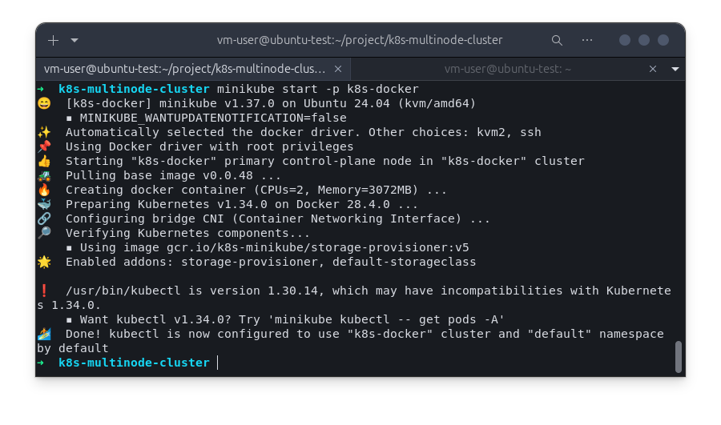
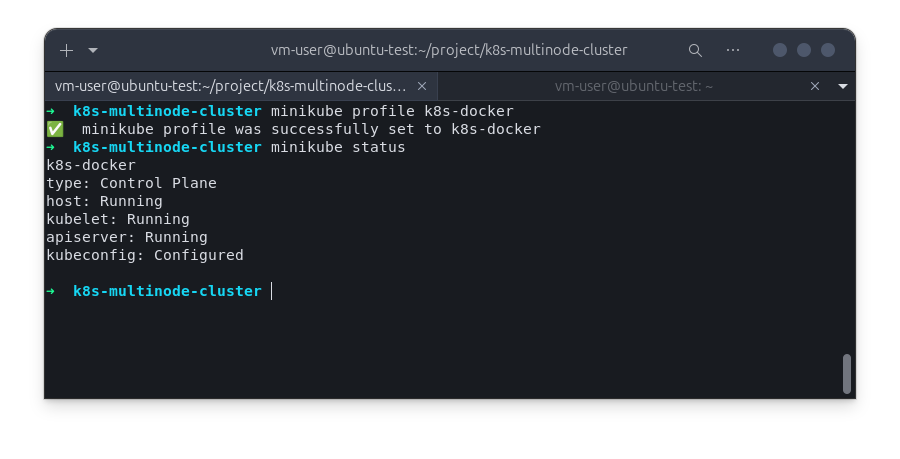
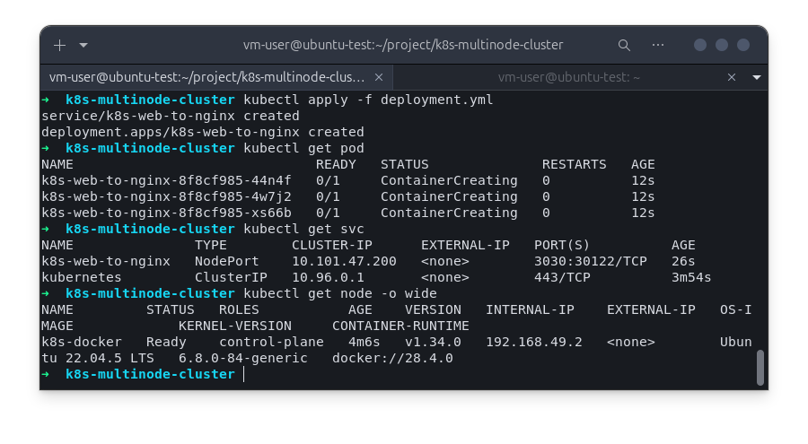
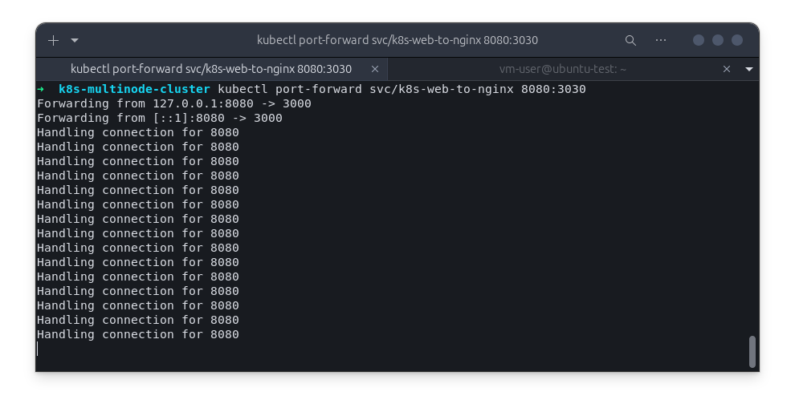
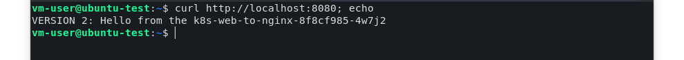
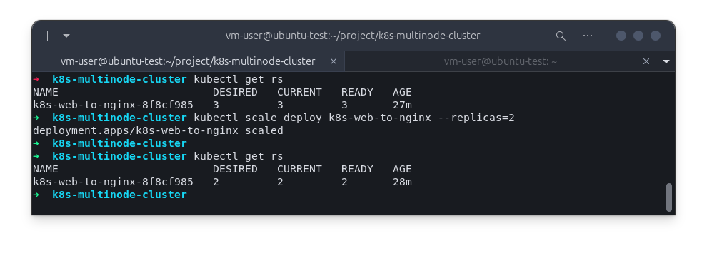
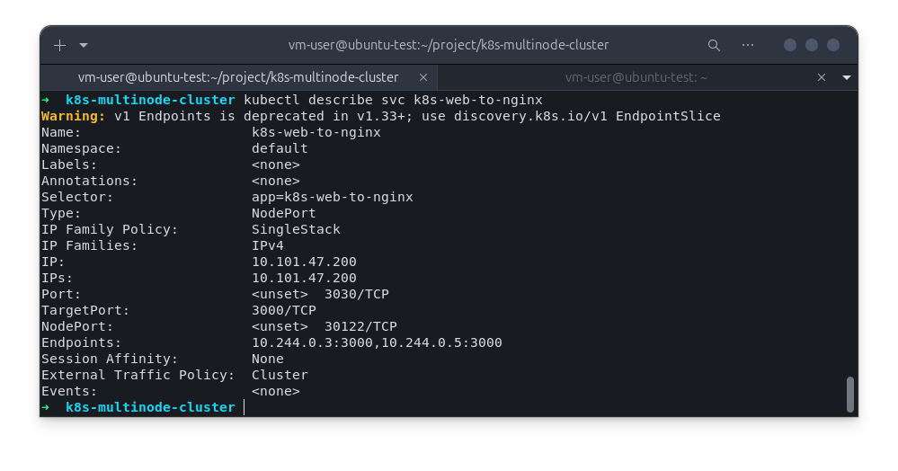
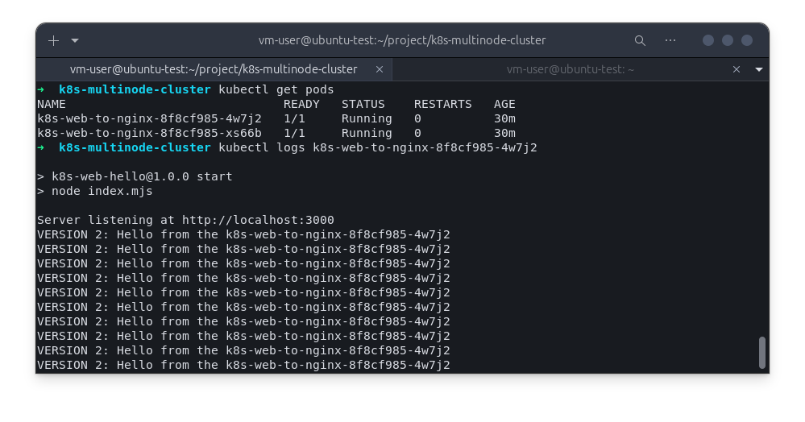

# 🚀 Kubernetes with Minikube – Nginx Deployment

This project demonstrates how to build a **local Kubernetes cluster using Minikube**, deploy an **Nginx application**, expose it via a **Service**, and test it locally.

---

## Install & Start Minikube

```bash
# Install Minikube (Linux example)
curl -LO https://storage.googleapis.com/minikube/releases/latest/minikube-linux-amd64
sudo install minikube-linux-amd64 /usr/local/bin/minikube

# Start a local cluster (using Docker as driver)
minikube start --driver=docker

# Verify minikube config
minikube status
```

## Create a Deployment

Apply the deployment:
```bash
kubectl apply -f deployment.yaml
kubectl get pods
```
## Scale Down the Deployment
```bash
kubectl scale deployment k8s-web-to-nginx --replicas=2
kubectl get pods
```
## Inspect Resources
Describe a pod
```bash
kubectl describe pod <pod-name>
```
## View logs from a pod
```bash
kubectl logs <pod-name>
```

## Deliverables

>Note: deployment.yaml and service.yaml files in separated would be way better.


## Screenshots of:

Installation
  

  


---

kubectl get pods<br>
kubectl get svc
  

  


---

Curl showing Nginx webpage (minikube service nginx-service)
  


---
Screenshot after scaling to 2 replicas.
  


---
Screenshot of kubectl describe pod output.
  

  


# Troubleshooting

If curl inside a pod is missing:
```bash
kubectl run curlpod --rm -it --image=radial/busyboxplus:curl -- /bin/sh
curl http://nginx-service
```

If NodePort is not accessible directly, use:
```
minikube service nginx-service --url
```

> You now have a fully working Kubernetes cluster on Minikube with Nginx deployed and exposed! 🎉
